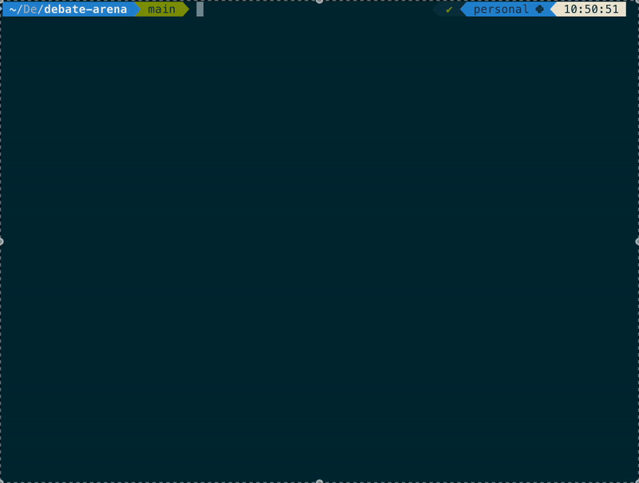

# 🎭 Debate Arena

Simulate language models engaging in structured debates on user-provided motions.

<p align="center">
  
</p>

## ✨ Features

- 🤖 Support for multiple AI models
- 🎯 Structured debate format with proposition and opposition speakers
- 🎨 Rich terminal UI with color-coded speakers and panels
- 🔄 Turn-based debate flow with strategic responses
- 🏳️ Graceful debate forfeiture when a speaker concedes
- 📝 Detailed planning and response tracking

## 🚀 Getting Started

### Prerequisites

- Python 3.8+
- OpenAI API key

### Installation

1. Clone the repository:
   ```bash
   git clone https://github.com/yourusername/debate-arena.git
   cd debate-arena
   ```

2. Install dependencies:
   ```bash
   pip install -r requirements.txt
   ```

3. Set up your OpenAI API key:
   ```bash
   export OPENAI_API_KEY='your-api-key-here'
   ```

## 🎮 Usage

1. Run the debate simulation:
   ```bash
   python start_debate.py
   ```

2. Follow the interactive prompts to:
   - Select AI models for both speakers
   - Enter your debate motion
   - Watch the debate unfold!

## 🎯 Example Debate Motions

- "Social media does more harm than good"
- "Artificial intelligence will benefit humanity"
- "Climate change is the biggest threat to humanity"
- "Remote work should be the new normal"

## 🤖 Supported Models

The platform supports various OpenAI models that support function calling.

## 📝 Debate Format

1. Speaker 1 (Proposition) opens with their initial argument
2. Speaker 2 (Opposition) responds
3. Speakers take turns responding to each other
4. Debate continues until one speaker concedes or forfeits

Each response is limited to 500 characters to ensure concise and focused arguments.
